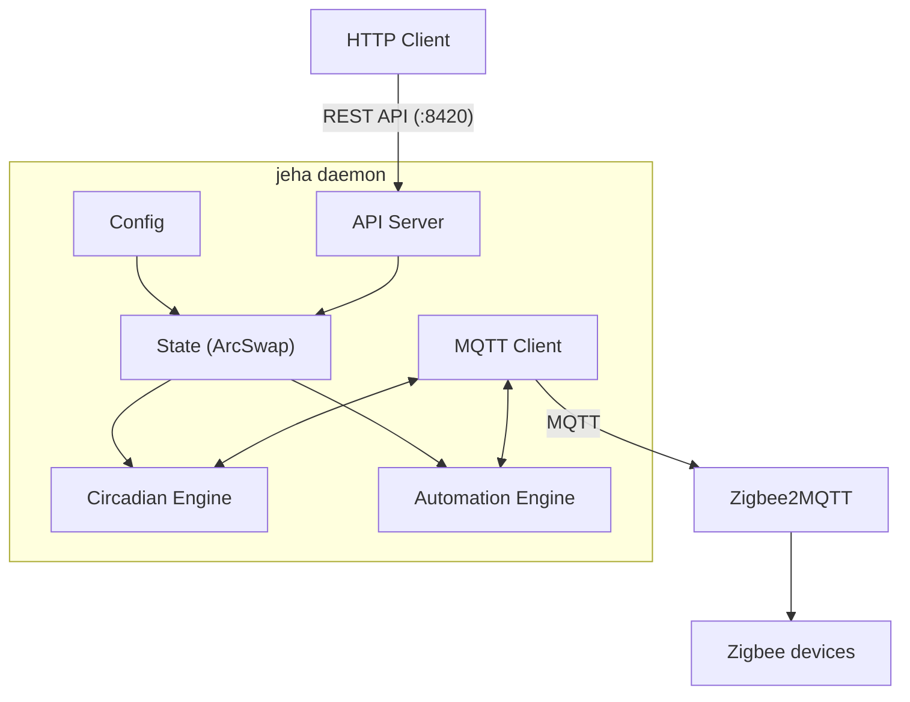

<p align="center">
  
</p>

# jeha

Opinionated, batteries-included light automation daemon for [Zigbee2MQTT](https://www.zigbee2mqtt.io/).

jeha does one thing well: **lighting**. Circadian rhythms, motion-activated lights, night mode, scenes - all with sensible defaults that work out of the box. Point it at your Z2M instance and your lights just work. For everything else (climate, media, blinds, complex automations), use [Home Assistant](https://www.home-assistant.io/) or similar.

Single static binary. No runtime dependencies. The Docker image is under 10MB (Home Assistant's is 2.3GB).

## Why

The best home automation interface is no interface. Lights should just work: right color temperature, right brightness, right time of day, without anyone touching an app. See [this post](https://vpetersson.com/2025/06/07/home-assistant-revamp/) for the full rationale.

Home Assistant is great at being a general-purpose platform, but that generality comes with complexity. Light automations break in predictable ways: devices vanish when renamed, Flux updates lights that are off, motion sensors fail silently, config reloads are all-or-nothing. jeha takes the opposite approach: a focused Rust daemon that only does lighting, talks directly to Z2M over MQTT, and makes the common case trivial.

## Philosophy

- **Sensible defaults.** Define a room with a Z2M group and you get circadian lighting. Add a motion sensor and lights turn on/off automatically. Most rooms need nothing beyond a name and a group.
- **Batteries included.** Circadian curves, motion timeouts, night mode, scenes, lights-out schedules — all built in. The common case works with minimal config; custom automations are there when you need them.
- **Instant response.** Light automation must be fast. jeha is a native Rust daemon that talks directly to Z2M over MQTT with no middleware, no interpreters, no round-trips through a web framework. Flip a switch or trigger a motion sensor and lights respond immediately.
- **Lighting only.** jeha is deliberately not a general-purpose home automation platform. It does lighting extremely well and nothing else. Use it alongside Home Assistant, not instead of it.
- **Convention over configuration.** Rooms with motion sensors get automatic on/off behavior. Circadian defaults are tuned for residential use. Override when you need to, but most people won't.

## Principles

- **IEEE addresses as identity.** Device names change. IEEE addresses don't. Config references hardware addresses; friendly names resolve at runtime from Z2M.
- **Z2M as source of truth.** Groups, devices, and capabilities are pulled directly from Z2M at startup. One MQTT message per group instead of per-bulb. Less Zigbee traffic, no config duplication.
- **No database.** All state derives from config + Z2M retained messages + current time. Restart at any point and converge in seconds.
- **Never update lights that are off.** Circadian only pushes to rooms with lights ON.
- **External change detection.** If someone activates a Z2M scene or uses a remote, jeha detects the state change and pauses circadian automatically.
- **API-first.** REST API as the primary programmatic interface. No web UI. Control your lights from any HTTP client or integrate with AI assistants.

## Quick start

```sh
docker run --rm -v $(pwd):/out vpetersson/jeha:latest init --mqtt <mqtt-host>:1883 --output /out/config.toml
# Review and edit config.toml
docker run -d --name jeha --restart unless-stopped \
  -v $(pwd)/config.toml:/config.toml \
  vpetersson/jeha:latest
```

`jeha init` connects to Z2M, discovers groups and devices, and generates a starter config. See [docker-compose.example.yml](docker-compose.example.yml) for a full stack example.

## Configuration

TOML config generated by `jeha init`. Minimal working config:

```toml
schema_version = 1

[rooms.kitchen]
z2m_group = "Kitchen"
```

That gives you circadian lighting with sensible defaults (cosine curve, 06:00-23:00, 2700K-4500K-2200K). Add a motion sensor and lights turn on/off automatically:

```toml
[rooms.hallway]
z2m_group = "Hallway"
motion_sensor = "0x00158d0004abcdef"
motion_timeout_secs = 120  # lights off 2 min after motion clears (default: 300)
```

### General settings

```toml
[general]
timezone = "UTC"                      # Timezone for schedules
motion_timeout_secs = 300             # Default motion timeout (5 min)
external_brightness_tolerance = 15    # Brightness drift before detecting external change
external_color_temp_tolerance = 25    # Color temp drift (mired) before detecting external change
external_override_secs = 1800         # How long to pause circadian after external change (30 min)
remote_brightness_step = 25           # Brightness step for remote dim up/down
```

### Circadian defaults

Global circadian settings control the daily light curve for all rooms. Defaults shown:

```toml
[circadian.defaults]
wake_time = "06:00"           # Start of day — lights begin warming up
sleep_time = "23:00"          # Bedtime — lights reach warmest/dimmest
start_temp_k = 2700           # Color temp at wake (warm white)
peak_temp_k = 4000            # Color temp at midday (cool white)
end_temp_k = 2200             # Color temp at sleep (warmest)
start_brightness = 150        # Brightness at wake
peak_brightness = 254         # Brightness at midday (max)
end_brightness = 77           # Brightness at sleep
ramp_duration_mins = 180      # Minutes to ramp between points
curve = "cosine"              # Interpolation: "cosine" or "linear"
transition_secs = 30          # Z2M transition time per update
update_interval_secs = 60     # How often to push new values
```

Override any of these per room:

```toml
[rooms.kitchen.circadian]
peak_temp_k = 5500
peak_brightness = 254
sleep_time = "22:00"
```

Disable circadian for a room entirely:

```toml
[rooms.porch]
z2m_group = "Porch"
circadian_enabled = false
```

jeha auto-discovers new Z2M groups with lights and appends them to the config file. Restart or send SIGHUP to apply.

### Night mode

Night mode sets lights to the warmest color and minimum brightness. Global defaults:

```toml
[night_mode.defaults]
color_temp_k = 2000           # Warmest available
brightness = 2                # Near minimum
motion_timeout_secs = 120     # Shorter timeout during night
```

Enable night mode on a schedule per room:

```toml
[rooms.bedroom.night_mode]
schedule = { after = "22:00", before = "06:30" }
```

Override night mode values per room:

```toml
[rooms.bedroom.night_mode]
schedule = { after = "22:00", before = "06:30" }
color_temp_k = 2000
brightness = 5
motion_timeout_secs = 60
```

### Schedules

jeha has a unified schedule predicate engine for time-based gating. Schedules support time ranges (with midnight crossover), day-of-week filters, and month filters. All present fields are ANDed; empty filters match everything.

Simple time window:

```toml
schedule = { after = "22:00", before = "06:30" }
```

With day filter (weekdays only):

```toml
schedule = { after = "08:00", before = "17:00", days = ["mon", "tue", "wed", "thu", "fri"] }
```

With month filter (winter mornings):

```toml
schedule = { after = "06:00", before = "09:00", months = ["oct", "nov", "dec", "jan", "feb"] }
```

Composite (weekday evenings OR weekend all-evening):

```toml
[rooms.living.night_mode]
schedule.any = [
    { after = "22:00", before = "06:00", days = ["mon", "tue", "wed", "thu", "fri"] },
    { after = "20:00", before = "08:00", days = ["sat", "sun"] },
]
```

Schedules can be used in:
- **Night mode**: `rooms.<name>.night_mode.schedule`
- **Motion gating**: `rooms.<name>.motion_schedule` — built-in motion handling only runs when the schedule matches
- **Automations**: `automations[].schedule` — automation only fires when the schedule matches

Motion schedule example (office motion only on weekdays during work hours):

```toml
[rooms.office]
z2m_group = "Office"
motion_sensor = "0x00158d000AAAAAAA"
motion_schedule = { after = "08:00", before = "17:00", days = ["mon", "tue", "wed", "thu", "fri"] }
```

Automation with schedule gate:

```toml
[[automations]]
id = "winter_mornings"
rooms = ["office"]
schedule = { after = "06:00", before = "09:00", months = ["oct", "nov", "dec", "jan", "feb"] }
[automations.trigger]
type = "motion"
[automations.action]
type = "lights_on"
use_circadian = true
```

### Lights-out

Lights-out turns off all lights at 01:00 by default. Configure or disable:

```toml
[lights_out]
enabled = true
time = "01:00"
```

Exclude a room from lights-out:

```toml
[rooms.porch]
z2m_group = "Porch"
lights_out = false
```

## CLI

```
jeha run [--config path]              # Start daemon
jeha run --mqtt-host 10.0.0.5        # Override MQTT host
jeha run --api-bind 0.0.0.0:8420     # Override API bind address
jeha validate [--config path]         # Validate config
jeha validate --check-devices         # Also verify against live Z2M
jeha schema                           # Export JSON Schema
jeha init                             # Auto-generate config from Z2M
jeha init --mqtt-host 10.0.0.5       # Custom MQTT host
jeha init --output config.toml        # Write directly to file
jeha migrate [--config path]          # Migrate config to latest schema
jeha migrate --dry-run                # Preview migration without writing
```

## Environment variables

| Variable | Description |
|---|---|
| `JEHA_MQTT_HOST` | MQTT broker host |
| `JEHA_MQTT_PORT` | MQTT broker port |
| `JEHA_MQTT_TOPIC` | Z2M base topic (default: `zigbee2mqtt`) |
| `JEHA_API_BIND` | API server bind address (default: `127.0.0.1:8420`) |

CLI arguments take precedence over env vars, which take precedence over config file values.

## REST API

jeha exposes a REST API on port 8420:

| Endpoint | Method | Description |
|---|---|---|
| `/api/rooms` | GET | List all rooms with light state, circadian status, occupancy |
| `/api/rooms/{room_id}` | GET | Detailed state for one room |
| `/api/rooms/{room_id}/light/on` | POST | Turn on with optional brightness/color_temp/override TTL |
| `/api/rooms/{room_id}/light/off` | POST | Turn off |
| `/api/rooms/{room_id}/scene` | POST | Predefined scenes: bright, relax, movie, energize, nightlight |
| `/api/rooms/{room_id}/z2m-scenes` | GET | List Z2M scenes available for a room |
| `/api/rooms/{room_id}/z2m-scenes/recall` | POST | Activate a Z2M scene (pauses circadian) |
| `/api/rooms/{room_id}/circadian/pause` | POST | Stop circadian adjustments indefinitely |
| `/api/rooms/{room_id}/circadian/resume` | POST | Resume circadian |
| `/api/rooms/{room_id}/circadian/snooze` | POST | Pause circadian for N hours, auto-resume |
| `/api/rooms/{room_id}/night-mode` | POST | Toggle night mode |
| `/api/circadian` | GET | Current targets for all rooms |
| `/api/system` | GET | MQTT/Z2M connection, uptime, device counts |

Errors use HTTP status codes (400, 404, 500) with `{"error": "message"}` body.

## Circadian curve

Cosine interpolation between three points: wake (warm), midday (cool), sleep (warmest). 30-second transitions between updates make changes imperceptible. Configurable per room. Can be disabled per room with `circadian_enabled = false`.

## Resilience

| Scenario | Behavior |
|---|---|
| Device renamed in Z2M | Auto-updates from `bridge/devices` (IEEE is stable) |
| Device comes online | Pushes correct circadian state immediately (3s transition) |
| Z2M scene activated externally | Detects state change, pauses circadian |
| MQTT disconnects | Auto-reconnect, re-push all rooms |
| jeha restarts | Stateless rebuild from config + Z2M retained messages |
| Bad config on reload | Rejects, keeps old config running |

## Architecture



## Building from source

```sh
cargo build --release --target $(uname -m)-unknown-linux-musl
```

Or with Docker:

```sh
docker build -t jeha .
```

## License

GPL-3.0
